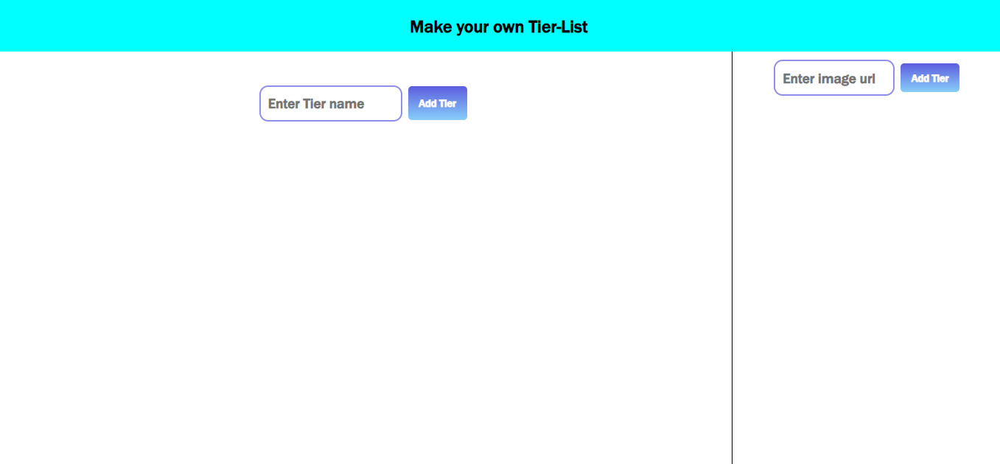
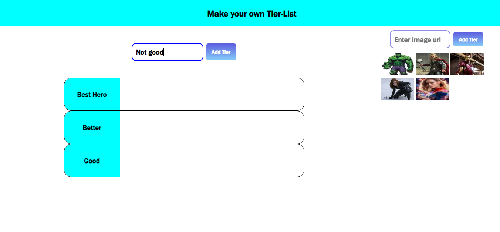
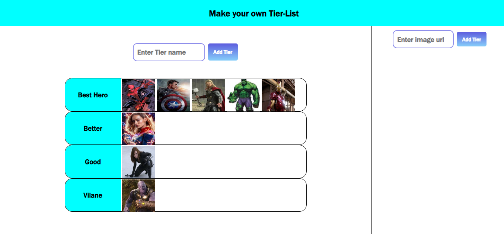

# Tier List Project

## Demo
- [click here](https://rupam-mondal.github.io/Tier-List/)

## Description
This project allows users to create and arrange tier lists based on their preferences. Users can add images and organize items into different tiers.

## Features
- **Image Upload**: Users can upload images for each item.
- **Tier Arrangement**: Items can be categorized into different tiers (e.g., S-tier, A-tier, B-tier, etc.).
- **Drag-and-Drop**: Users can rearrange items within tiers using drag-and-drop functionality.
- **Customizable**: Users can customize the tier names.

## Screenshots

## Contributing
Feel free to contribute by opening pull requests or reporting issues.